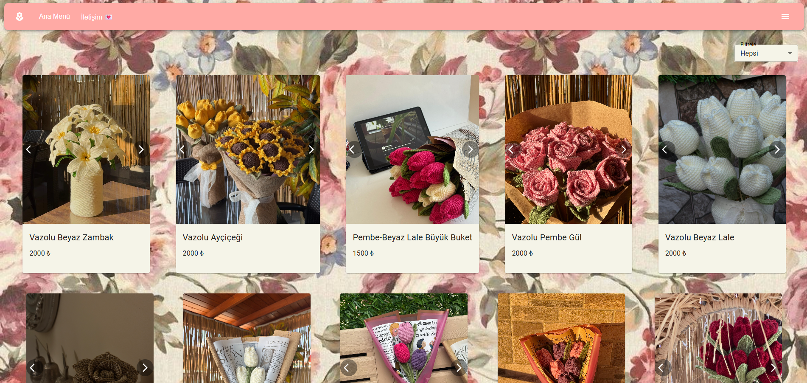

# 🌸 nesflowers

**nesflowers**, örgü (el işi) çiçeklerin sergilendiği modern ve kullanıcı dostu bir web sitesidir.  
Proje, hem ziyaretçiler için hazırlanmış bir **ana vitrin (frontend)** hem de içeriklerin yönetildiği bir **admin paneli** içermektedir.

🔗 **Canlı Site:** https://nesflowers.com

---

## 🧠 Proje Hakkında

Bu proje, örgü çiçeklerin görsellerini ve içeriklerini şık bir arayüz ile sunmayı amaçlar.  
Admin paneli sayesinde site içerikleri kolayca yönetilebilir, güncellenebilir ve kontrol altında tutulur.

---

## 🖼️ Ekran Görüntüleri

### 🌸 Ana Sayfa
Kullanıcıların gördüğü vitrin ekranı. Çiçeklerin listelendiği ve tanıtıldığı ana arayüzdür.

---

### 🔐 Admin Paneli
Site içeriklerinin yönetildiği yönetici ekranı.

- Çiçek ekleme / silme / güncelleme  
- İçerik kontrolü  
- Site yönetimi  

---

## 🚀 Özellikler

### 👤 Kullanıcı (Frontend)
- Örgü çiçeklerin listelenmesi
- Mobil uyumlu (responsive) tasarım
- Modern ve sade arayüz

### 🛠️ Admin Paneli
- İçerik yönetimi
- Çiçek ekleme / düzenleme / silme
- Yönetici odaklı arayüz
- Genişletilebilir yapı
  
---

## 🧩 Kullanılan Teknolojiler

- **React**
- **Vite**
- **JavaScript (ES6+)**
- **HTML5**
- **CSS3**

---

